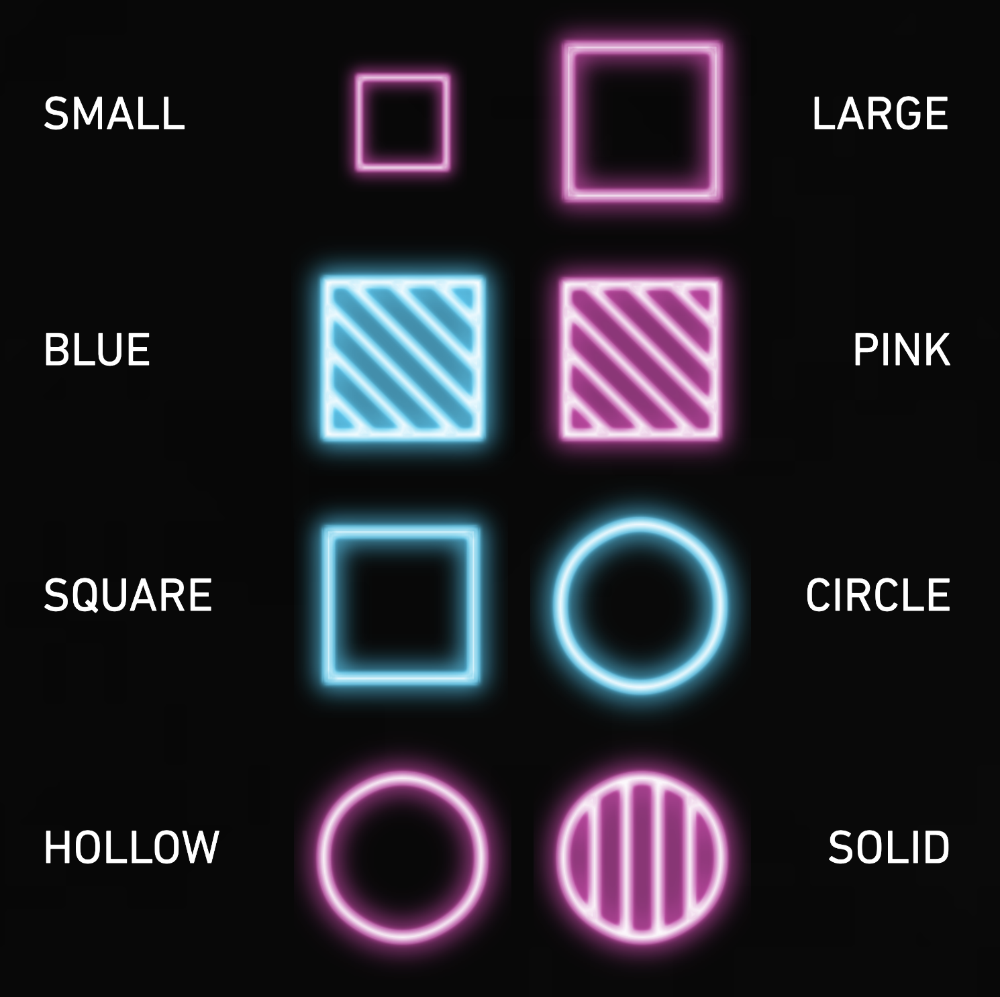
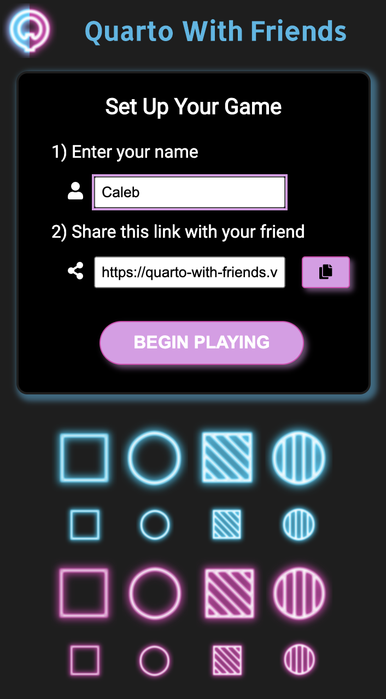
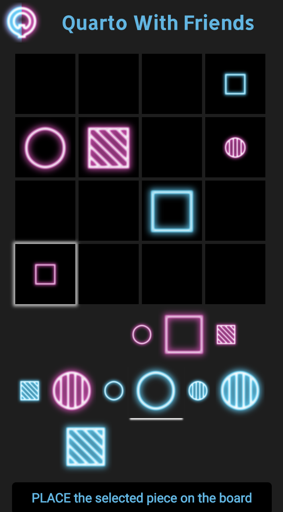
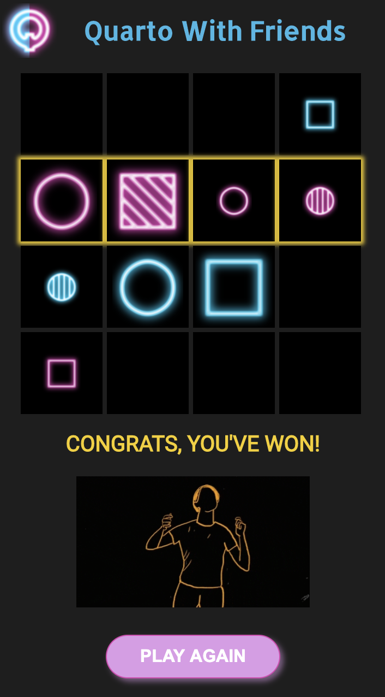

# Quarto With Friends API

## Resources

There are two main resources accessible through the Quarto With Friends API:

1) Games
2) Moves

An example game:
> { 
  id: 'e1564da3-797a-4fb1-975e-4f3935d7eeca' , 
  host: 'Caleb' , 
  guest: 'Toby' , 
}

An example move:
> { 
  id: 24 , 
  gameId: 'e1564da3-797a-4fb1-975e-4f3935d7eeca' , 
  moveType: 'selection' , 
  value: 7 , 
}

 

## Available Endpoints

### Base URL : `'https://obscure-harbor-97497.herokuapp.com'`

### Route: `/games`

* `GET '/games'`
* `POST '/games'`

### Route: `/games/:gameId`

* `GET '/games/:gameId'`
* `PATCH '/games/:gameId'`

### Route: `/games/:gameId/moves`

* `GET '/games/:gameId/moves'`
* `POST '/games/:gameId/moves'`
* `DELETE '/games/:gameId/moves'`

 

## Scripts

Start the application `npm start`

Run the tests `npm test`

 

## Technical Requirements

* Uses React, Node, Express, and PostgreSQL.
* The client and API are deployed separately and stored in separate GitHub repos. (The GitHub for the client can be found [here](https://github.com/caleb-king/quarto-with-friends))
* Uses a responsive and mobile-first design.
* Uses semantic HTML/JSX.
* Uses vanilla CSS for styling.
* Both client- and server-side code is tested.
* Includes a landing page that explains what the app does and how to get started.
* Is live and publicly-accessible.
* Follows a11y best practices.
* Works across different browsers. (Chrome, Firefox, and Safari)

  

# Quarto With Friends Client
* [live app](https://quarto-with-friends.vercel.app/)

## Summary

 

Quarto With Friends is a web app which provides a way to remotely play the game Quarto with a friend. You share the link and then alternate turns selecting and placing pieces until a winner is declared. 

Quarto is a modern classic strategy game using pieces which combine 4 attributes – size, color, shape, and consistency:

 

  

The goal is to place the fourth piece in a row or diagonal where each piece shares one attribute in common.

The twist is that your opponent chooses the piece you place on the board each turn.
  
## Screenshots

 

**Game Setup:**

   

**Gameplay:**

   

**Winner: (with neon dancing GIF)** 

   